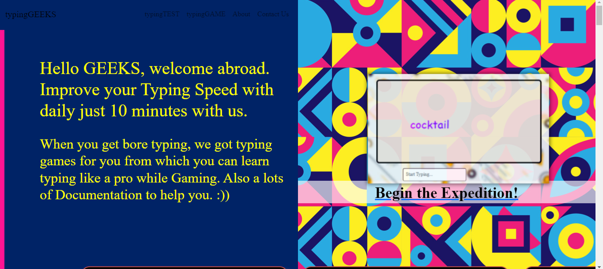
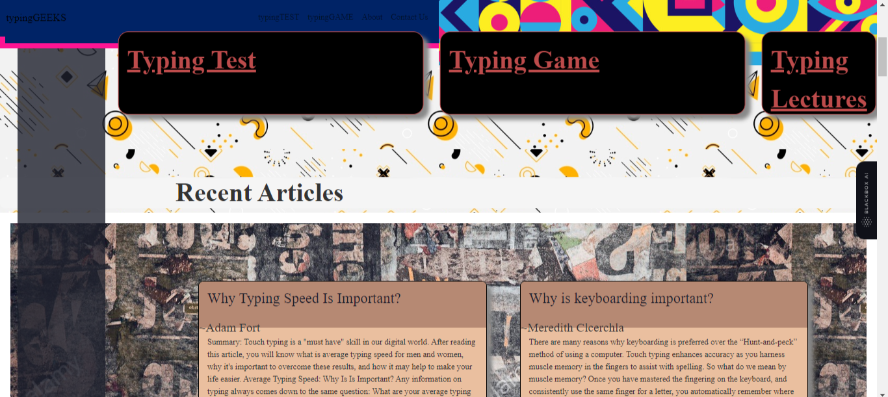
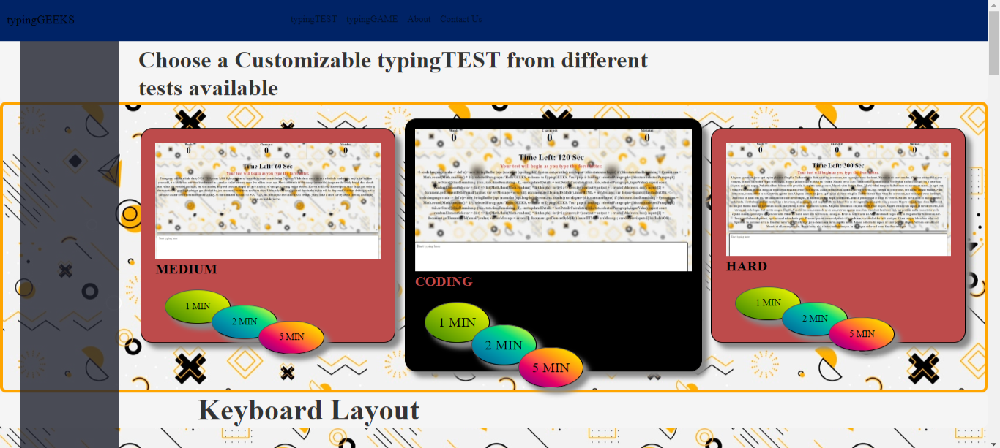
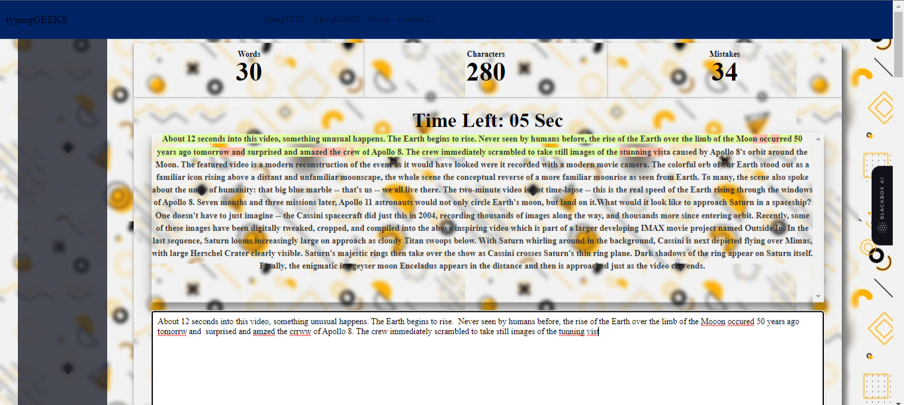
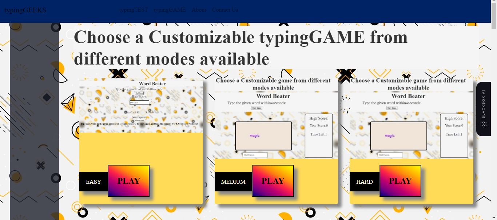
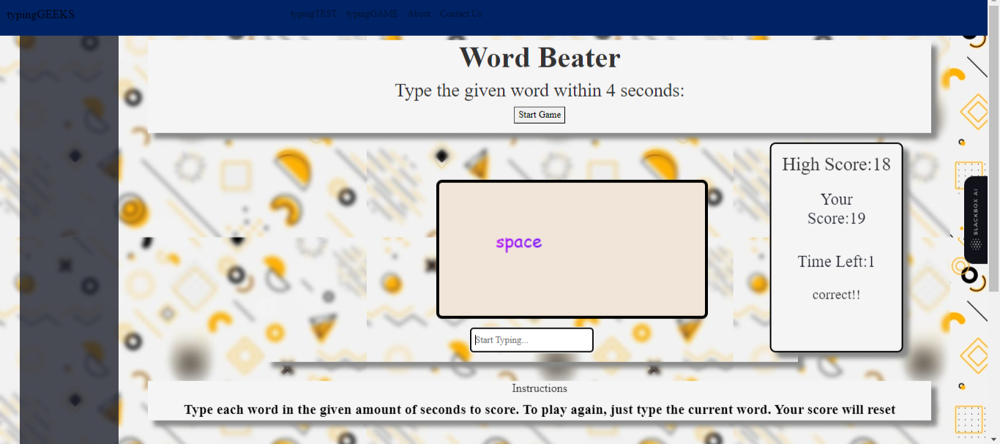

# Typing Geeks

Welcome to **Typing Geeks**, your go-to place to enhance your typing skills and have fun while doing it. This project is all about putting your typing speed to the test and learning in an engaging way, built entirely with the power of **React**.

## Description

**Typing Geeks** is a React-based website designed to help you improve your typing speed and accuracy. It offers a range of timed typing tests with different time limits (1 minute, 2 minutes, 5 minutes) and various text categories including simple text, code snippets, and challenging text. 

## Features

- Test your typing speed with different time limits and text categories.
- Engage with typing games to learn and practice in a playful manner.
- Two difficulty levels for typing games: easy and medium.
- Local storage to save your highest scores and track your progress.
- Basic documentation about keyboards and tips to increase typing speed.
- Future-ready with the possibility to add more exciting features.

## Technologies Used

- React
- HTML
- CSS
- JavaScript

## Screenshots

<table>
  <tr>
    <tr>
    <td align="center">
      
    </td>
    <td align="center">
      
    </td>
  </tr>
  <tr>
    <td align="center">
      
    </td>
    <td align="center">
      
    </td>
  </tr>
  <tr>
    <td align="center">
      
    </td>
    <td align="center">
      
    </td>
</table>

## Usage

1. Clone the repository: `git clone <https://github.com/Mr-Daksh/Typing-Geeks.git>`
2. Navigate to the project directory: `cd Typing-Geeks`
3. Install dependencies: `npm install`
4. Run the project: `npm start`
5. Explore typing tests, games, and educational content.

## Contributing

Contributions are welcome! If you have ideas for new features or improvements, feel free to submit a pull request.

## Contact

- Daksh Sahu
- dakshsahu24@gmail.com

